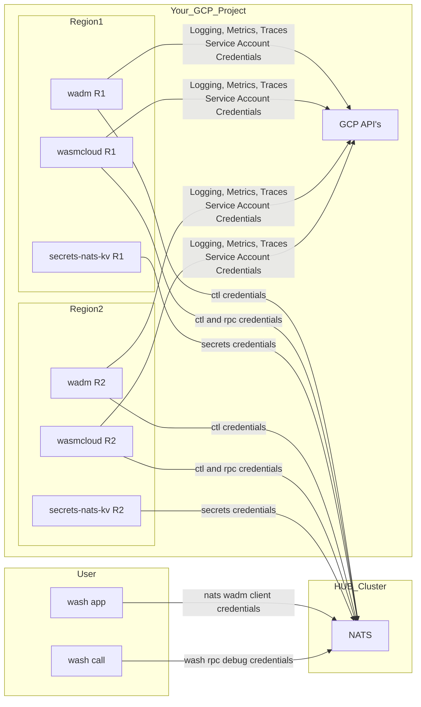

# map-tf-wasmcloud-cr

This terraform module provisions wasmcloud, wadm and secrets-nats-kv instances as
Google Cloud Run services.

> It now supports running in multiple cloud regions!

Yes, we pack components and providers in serverless infrastructure! Fun!

> The module requires you to bring your own NATS infrastructure.

Both the wasmcloud and wadm service runs the otel collector as a sidecar and write 
to Google Cloud Platform backends (logging, metrics, traces).




## Status

The module is a work in progress and wholly unfinished. It may work for you, it may not. Here be dragons!

## Todo

- figure out CLUSTER_SEED implications.
- secrets client usage.
- improve otel configuration
- better way to health check a deployment of this module than to rely on otel endpoints :D
- decide on a meaningful labling of hosts
- lots more :)

## Prerequisites 

## Secret Keys

```
# This is just an example, do not use theese values:

❯ wash keys gen curve

Public Key: XBJZQSHGFBF3EEXE3CQT3J6Y2QCOMZN6JOG7RC7GTQI6YBPM44OOS4OV
Seed: SXAEHGFHGEHFZSCI4ZMTKTER4BUMJEI7T76WWP6722POEI4MKBY7YPUFQA
```

Use the provided shell script(`gcp-gen-key-secrets.sh`) to generate the key pairs:

```bash
./gcp-gen-key-secrets.sh <your_project_id>
```

> The "seed-key" secrets created are used as input variables in the terraform module as illustrated below.

### NATS

A working NATS infrastucture with Jetstream enabled, that is connectable from Google Cloud Run Services.

### Predefined secrets

This module requires three named secrets that must exist as 'Secrets' with a valid 'Secret Version' in Secret Manager.

```terraform
  wcrpc_secret_name = "something"
  wcctl_secret_name = "something else"
  wadm_secret_name = "yet another thing"
  secrets_nats_kv_transit_secret_name    = "nats-kv-secrets-transit-seed-key"
  secrets_nats_kv_encryption_secret_name = "nats-kv-secrets-encryption-seed-key"
 ```

See the following section on `NATS Users` on how to configure the required permissions.

> If you are just starting out, you may use the same secret with all permissions for all purposes. Not recomended in a production setting.

### NATS Users

> WARNING: This documentation is just placeholder information. WIP ongoing for actual subject filters required. 

#### wasmCloud RPC

> Showing just default lattice. 

```plaintext
publish.allow:
  default.*.wrpc.>

subscribe.allow
  default.*.wrpc.>
  _INBOX.>
```

#### wasmCloud CTL

```plaintext
publish.allow:
  wasmbus.ctl.v1.>
  wasmbus.evt.*.>

subscribe.allow
  wasmbus.ctl.v1.>
  wasmbus.evt.*.>
  _INBOX.>
```

#### wadm (server)

```plaintext
publish.allow
  wadm.api.>

subscribe.allow
  wadm.api.>
  wasmbus.evt.*.>
  _INBOX.>
```

#### wash app (wasmcloud users context) 

```plaintext
publish.allow:
  wadm.api.>
  wasmcloud.secrets.*.>

subscribe.allow:
  _INBOX.>
```

#### secrets-nats-kv (server)

```plaintext
publish.allow:
  $KV.wasmcloud_secrets.> 

subscribe.allow:
  wasmcloud.secrets.nats-kv.>
  $KV.wasmcloud_secrets.>
  _INBOX.>
```


## Usage

Terraform is usage is pretty much business as usual, but how to use the wasmcloud deployment
requires a bit of tinkering with client configuration.

### terraform 

> Version in usage may not exist, inspect repo releases/tags.

```terraform
module "wasmcloud" {
  source = "github.com/Mattilsynet/map-tf-wasmcloud-cr@v1.0.0"

  project_id = "your-gcp-project-id"

  wasmcloud_rpc_nats_host = "your.rpc.nats.infra"
  wasmcloud_ctl_nats_host = "your.ctl.nats.infra"
  wadm_nats_host          = "your.ctl.nats.infra" 

  wadm_secret_name  = "your-wadm-creds"
  wcctl_secret_name = "your-ctl-creds"
  wcrpc_secret_name = "your-rpc-creds"
 
  number_of_wadm_hosts = 1 
  number_of_wasmcloud_hosts = 2
}

```

### wash
```sh
# Create a new context
wash ctx new <gcpprojectid>

# Edit context
wash ctx edit <gcpprojectid>

# Set active context
wash ctx default <gcpprojectid>
```

### wash call

> WARNING! wash subcommands are not completely aligned with environment variables and don't respect the wash ctx properly.

```bash
export RUST_LOG="info,hyper=info,async_nats=info,oci_distribution=info,cranelift_codegen=warn"
export WASMCLOUD_RPC_HOST="your.nats.host"
export WASMCLOUD_RPC_PORT="4222"
export WASMCLOUD_RPC_TLS="true"
export WASH_RPC_CREDS="/path/to/your/rpc/credentials"
```


## Additional information

<!-- BEGIN_TF_DOCS -->
## Requirements

| Name | Version |
|------|---------|
| <a name="requirement_terraform"></a> [terraform](#requirement\_terraform) | >= 1.9.5 |
| <a name="requirement_external"></a> [external](#requirement\_external) | ~> 2.0 |
| <a name="requirement_google"></a> [google](#requirement\_google) | >= 6.3.0, < 7.0 |
| <a name="requirement_google-beta"></a> [google-beta](#requirement\_google-beta) | >= 6.3.0, < 7.0 |
| <a name="requirement_null"></a> [null](#requirement\_null) | ~> 3.0 |

## Providers

| Name | Version |
|------|---------|
| <a name="provider_google"></a> [google](#provider\_google) | >= 6.3.0, < 7.0 |

## Modules

No modules.

## Resources

| Name | Type |
|------|------|
| [google_artifact_registry_repository_iam_member.gar_repo_member](https://registry.terraform.io/providers/hashicorp/google/latest/docs/resources/artifact_registry_repository_iam_member) | resource |
| [google_cloud_run_v2_service.secrets_nats_kv_service](https://registry.terraform.io/providers/hashicorp/google/latest/docs/resources/cloud_run_v2_service) | resource |
| [google_cloud_run_v2_service.wadm_v2_service](https://registry.terraform.io/providers/hashicorp/google/latest/docs/resources/cloud_run_v2_service) | resource |
| [google_cloud_run_v2_service.wasmcloud_v2_service](https://registry.terraform.io/providers/hashicorp/google/latest/docs/resources/cloud_run_v2_service) | resource |
| [google_project_iam_member.wadm_iam_cloudtrace_agent](https://registry.terraform.io/providers/hashicorp/google/latest/docs/resources/project_iam_member) | resource |
| [google_project_iam_member.wadm_iam_log_writer](https://registry.terraform.io/providers/hashicorp/google/latest/docs/resources/project_iam_member) | resource |
| [google_project_iam_member.wadm_iam_metric_writer](https://registry.terraform.io/providers/hashicorp/google/latest/docs/resources/project_iam_member) | resource |
| [google_project_iam_member.wasmcloud_iam_cloudtrace_agent](https://registry.terraform.io/providers/hashicorp/google/latest/docs/resources/project_iam_member) | resource |
| [google_project_iam_member.wasmcloud_iam_log_writer](https://registry.terraform.io/providers/hashicorp/google/latest/docs/resources/project_iam_member) | resource |
| [google_project_iam_member.wasmcloud_iam_metric_writer](https://registry.terraform.io/providers/hashicorp/google/latest/docs/resources/project_iam_member) | resource |
| [google_project_service.gc_monitoring](https://registry.terraform.io/providers/hashicorp/google/latest/docs/resources/project_service) | resource |
| [google_project_service.gc_trace](https://registry.terraform.io/providers/hashicorp/google/latest/docs/resources/project_service) | resource |
| [google_secret_manager_secret.wasmcloud_cr_otel_config](https://registry.terraform.io/providers/hashicorp/google/latest/docs/resources/secret_manager_secret) | resource |
| [google_secret_manager_secret.wasmcloud_service_account_token](https://registry.terraform.io/providers/hashicorp/google/latest/docs/resources/secret_manager_secret) | resource |
| [google_secret_manager_secret_iam_member.secrets_nats_kv_secret_access](https://registry.terraform.io/providers/hashicorp/google/latest/docs/resources/secret_manager_secret_iam_member) | resource |
| [google_secret_manager_secret_iam_member.wadm_secret_access](https://registry.terraform.io/providers/hashicorp/google/latest/docs/resources/secret_manager_secret_iam_member) | resource |
| [google_secret_manager_secret_iam_member.wasmcloud_secret_access](https://registry.terraform.io/providers/hashicorp/google/latest/docs/resources/secret_manager_secret_iam_member) | resource |
| [google_secret_manager_secret_version.wasmcloud_otel_config_version](https://registry.terraform.io/providers/hashicorp/google/latest/docs/resources/secret_manager_secret_version) | resource |
| [google_secret_manager_secret_version.wasmcloud_service_account_key_secret_version](https://registry.terraform.io/providers/hashicorp/google/latest/docs/resources/secret_manager_secret_version) | resource |
| [google_service_account.secrets_nats_kv](https://registry.terraform.io/providers/hashicorp/google/latest/docs/resources/service_account) | resource |
| [google_service_account.wadm_service_sa](https://registry.terraform.io/providers/hashicorp/google/latest/docs/resources/service_account) | resource |
| [google_service_account.wasmcloud_service_sa](https://registry.terraform.io/providers/hashicorp/google/latest/docs/resources/service_account) | resource |
| [google_service_account_key.wasmcloud_service_sa_key](https://registry.terraform.io/providers/hashicorp/google/latest/docs/resources/service_account_key) | resource |
| [google_artifact_registry_repository.gar_repo](https://registry.terraform.io/providers/hashicorp/google/latest/docs/data-sources/artifact_registry_repository) | data source |
| [google_secret_manager_secret.secrets_nats_kv_encryption_secret](https://registry.terraform.io/providers/hashicorp/google/latest/docs/data-sources/secret_manager_secret) | data source |
| [google_secret_manager_secret.secrets_nats_kv_nats_creds](https://registry.terraform.io/providers/hashicorp/google/latest/docs/data-sources/secret_manager_secret) | data source |
| [google_secret_manager_secret.secrets_nats_kv_transit_secret](https://registry.terraform.io/providers/hashicorp/google/latest/docs/data-sources/secret_manager_secret) | data source |
| [google_secret_manager_secret.wadm_nats_creds](https://registry.terraform.io/providers/hashicorp/google/latest/docs/data-sources/secret_manager_secret) | data source |
| [google_secret_manager_secret.wasmcloud_ctl_nats_creds](https://registry.terraform.io/providers/hashicorp/google/latest/docs/data-sources/secret_manager_secret) | data source |
| [google_secret_manager_secret.wasmcloud_rpc_nats_creds](https://registry.terraform.io/providers/hashicorp/google/latest/docs/data-sources/secret_manager_secret) | data source |

## Inputs

| Name | Description | Type | Default | Required |
|------|-------------|------|---------|:--------:|
| <a name="input_gar_region"></a> [gar\_region](#input\_gar\_region) | The region in which to create the global address. | `string` | `"europe-north1"` | no |
| <a name="input_number_of_secrets_nats_kv_instances"></a> [number\_of\_secrets\_nats\_kv\_instances](#input\_number\_of\_secrets\_nats\_kv\_instances) | Number of NATS key-value store instances to run. | `number` | `1` | no |
| <a name="input_number_of_wadm_hosts"></a> [number\_of\_wadm\_hosts](#input\_number\_of\_wadm\_hosts) | Number of wadm hosts to run. | `number` | `1` | no |
| <a name="input_number_of_wasmcloud_hosts"></a> [number\_of\_wasmcloud\_hosts](#input\_number\_of\_wasmcloud\_hosts) | Number of wasmcloud hosts to run. | `number` | `1` | no |
| <a name="input_project_id"></a> [project\_id](#input\_project\_id) | The project ID to deploy the resources. | `string` | n/a | yes |
| <a name="input_regions"></a> [regions](#input\_regions) | The region in which to create the resources. | `list(string)` | <pre>[<br>  "europe-north1",<br>  "europe-north2"<br>]</pre> | no |
| <a name="input_secrets_nats_kv_encryption_secret_name"></a> [secrets\_nats\_kv\_encryption\_secret\_name](#input\_secrets\_nats\_kv\_encryption\_secret\_name) | The name of the secret that has the encryption xkey seed. | `string` | n/a | yes |
| <a name="input_secrets_nats_kv_secret_name"></a> [secrets\_nats\_kv\_secret\_name](#input\_secrets\_nats\_kv\_secret\_name) | The name of the secret to store the NATS key-value store credentials. | `string` | n/a | yes |
| <a name="input_secrets_nats_kv_transit_secret_name"></a> [secrets\_nats\_kv\_transit\_secret\_name](#input\_secrets\_nats\_kv\_transit\_secret\_name) | The name of the secret that has the transit xkey seed. | `string` | n/a | yes |
| <a name="input_version_otel_collector"></a> [version\_otel\_collector](#input\_version\_otel\_collector) | The version of OTEL collector to use. | `string` | `"0.127.0"` | no |
| <a name="input_version_wadm"></a> [version\_wadm](#input\_version\_wadm) | The version of wadm to deploy. | `string` | `"v0.21.0"` | no |
| <a name="input_version_wasmcloud"></a> [version\_wasmcloud](#input\_version\_wasmcloud) | The version of wasmcloud to deploy. | `string` | `"1.8.0"` | no |
| <a name="input_wadm_nats_host"></a> [wadm\_nats\_host](#input\_wadm\_nats\_host) | The hostname of the NATS server. | `string` | n/a | yes |
| <a name="input_wadm_nats_port"></a> [wadm\_nats\_port](#input\_wadm\_nats\_port) | The port of the NATS server. | `string` | `"4222"` | no |
| <a name="input_wadm_secret_name"></a> [wadm\_secret\_name](#input\_wadm\_secret\_name) | The name of the secret to store the wadm credentials. | `string` | n/a | yes |
| <a name="input_wasmcloud_ctl_nats_host"></a> [wasmcloud\_ctl\_nats\_host](#input\_wasmcloud\_ctl\_nats\_host) | The hostname of the NATS server for control interface. | `string` | n/a | yes |
| <a name="input_wasmcloud_ctl_nats_port"></a> [wasmcloud\_ctl\_nats\_port](#input\_wasmcloud\_ctl\_nats\_port) | The port of the NATS server for control interface. | `string` | `"4222"` | no |
| <a name="input_wasmcloud_rpc_nats_host"></a> [wasmcloud\_rpc\_nats\_host](#input\_wasmcloud\_rpc\_nats\_host) | The hostname of the NATS server. | `string` | n/a | yes |
| <a name="input_wasmcloud_rpc_nats_port"></a> [wasmcloud\_rpc\_nats\_port](#input\_wasmcloud\_rpc\_nats\_port) | The port of the NATS server. | `string` | `"4222"` | no |
| <a name="input_wcctl_secret_name"></a> [wcctl\_secret\_name](#input\_wcctl\_secret\_name) | The name of the secret to store the wasmcloud control plane credentials. | `string` | n/a | yes |
| <a name="input_wcrpc_secret_name"></a> [wcrpc\_secret\_name](#input\_wcrpc\_secret\_name) | The name of the secret to store the wasmcloud rpc credentials. | `string` | n/a | yes |

## Outputs

No outputs.
<!-- END_TF_DOCS -->
